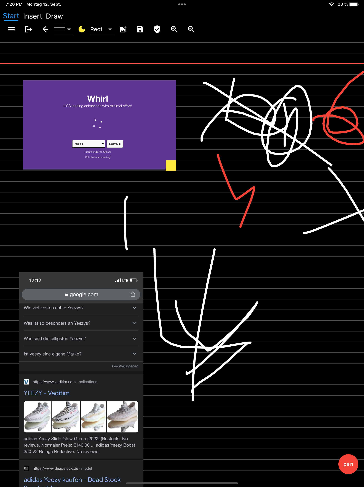

# SkyNote

A OneNote Clone build with Flutter.

## Backend

[Appwrite](https://github.com/appwrite/appwrite)

## Features

- Draw (Free, Lines, Rectangles, Circles)
- Images
- Text
- Lasso Select
- Move, Resize (not fully implemented)

## Screenshots

| Home                                      | Drawing                                      |
| ----------------------------------------- | -------------------------------------------- |
|  |  |

<!-- 
 -->

| Drawing Light mode                               | Renaming                                      |
| ------------------------------------------------ | --------------------------------------------- |
|  |  |

<!-- 
 -->
